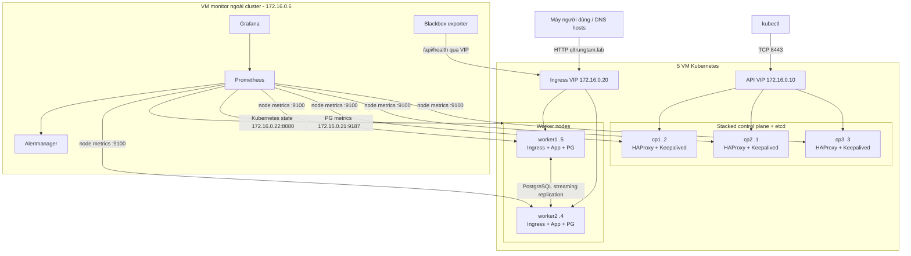

# Lab Kubernetes HA cho QLTrungTam

> Phạm vi: lab độc lập, không dùng lại dữ liệu, secret, domain hay hạ tầng production.
> Topology có **5 VM trong Kubernetes** (3 control plane + 2 worker) và **1 VM monitoring ngoài cluster**, tổng cộng 6 VM.

## 1. Mục tiêu

Sau lab này có thể kiểm chứng:

- kube-apiserver và stacked etcd còn quorum khi mất một control plane;
- API VIP tự chuyển giữa ba control plane;
- Ingress VIP tự chuyển giữa hai worker;
- Next.js chạy tối thiểu hai replica, không giữ state cục bộ;
- PostgreSQL có primary + streaming replica trên hai worker và tự promote khi mất primary;
- Prometheus/Grafana/Alertmanager nằm ngoài cluster nên vẫn quan sát được khi cluster lỗi;
- migration, seed, rollout, rollback, HPA và failure drill có quy trình rõ ràng.

Đây không phải bản thiết kế production. Local storage, HTTP, secret thủ công và chỉ hai bản PostgreSQL được chọn để lab gọn và nhìn rõ cơ chế Kubernetes.

## 2. Mô hình



Luồng request ứng dụng:

```text
client -> 172.16.0.20 (MetalLB) -> ingress-nginx -> Service qltrungtam
       -> một trong hai Next.js Pod -> qltrungtam-postgres-rw
       -> CloudNativePG primary
```

## 3. Kế hoạch VM, IP và tài nguyên

Mạng VM thực tế là `172.16.0.0/24`, đi qua NIC `eth1`. Pod CIDR và Service CIDR không được trùng mạng VM.

Ánh xạ worker bên dưới theo đúng thứ tự hai output cuối bạn gửi (`worker1=.5`, `worker2=.4`). VM monitor `.6` và các VIP `.10`, `.20-.22` là địa chỉ lab được đề xuất; phải kiểm tra chúng đang trống trước khi sử dụng.

| VM / VIP | IP | vCPU | RAM | Disk | Vai trò |
| --- | --- | ---: | ---: | ---: | --- |
| cp1 | `172.16.0.2` | 2 | 4 GiB | 40 GiB | control plane, etcd, API LB |
| cp2 | `172.16.0.1` | 2 | 4 GiB | 40 GiB | control plane, etcd, API LB |
| cp3 | `172.16.0.3` | 2 | 4 GiB | 40 GiB | control plane, etcd, API LB |
| worker1 | `172.16.0.5` | 4 | 8 GiB | 80 GiB | app, ingress, PostgreSQL |
| worker2 | `172.16.0.4` | 4 | 8 GiB | 80 GiB | app, ingress, PostgreSQL |
| monitor | `172.16.0.6` | 4 | 8 GiB | 80 GiB | Prometheus, Grafana, Alertmanager |
| API VIP | `172.16.0.10:8443` | - | - | - | Keepalived + HAProxy |
| App VIP | `172.16.0.20:80` | - | - | - | MetalLB + ingress-nginx |
| PG metrics VIP | `172.16.0.21:9187` | - | - | - | postgres-exporter |
| KSM metrics VIP | `172.16.0.22:8080` | - | - | - | kube-state-metrics |

Các mạng Kubernetes:

- Pod CIDR: `192.168.0.0/16` (Calico).
- Service CIDR: `10.96.0.0/12`.
- MetalLB pool: `172.16.0.20-172.16.0.29`; dải này phải được loại khỏi DHCP.

### Lưu ý riêng cho Kamatera

Sáu VM phải ở cùng datacenter và cùng một Kamatera Private Local Network/VLAN. Không mua public IP và không gắn cố định `172.16.0.10` vào một VM trong Netplan: đây là secondary VIP do Keepalived thêm/xóa trên `eth1`. Tương tự, MetalLB quản lý `.20-.29`.

Trong Kamatera Console, kiểm tra `.10` và `.20-.29` chưa được chọn cho NIC nào, ghi chúng vào danh sách IP dành riêng của lab và không cấp các địa chỉ này cho VM mới. Tài liệu công khai của Kamatera không cam kết rõ VRRP/GARP ở mọi zone, nên thực hiện bài test sau trước khi `kubeadm init`.

Trên cp1:

```bash
sudo ip address add 172.16.0.10/24 dev eth1
sudo arping -U -I eth1 -c 3 172.16.0.10
```

Từ cp2 và cp3:

```bash
ping -c 3 172.16.0.10
ip neighbor show 172.16.0.10
```

Sau đó chuyển thử VIP từ cp1 sang cp2:

```bash
# cp1
sudo ip address del 172.16.0.10/24 dev eth1

# cp2
sudo ip address add 172.16.0.10/24 dev eth1
sudo arping -U -I eth1 -c 3 172.16.0.10
```

Ping lại từ cp3. Nếu `.10` đi theo node mới thì VLAN hỗ trợ mô hình Keepalived/MetalLB của lab; xóa IP test trên cp2 trước khi bật Keepalived:

```bash
sudo ip address del 172.16.0.10/24 dev eth1
```

Nếu IP không reachable hoặc MAC không chuyển, mở ticket Kamatera hỏi quyền dùng VRRP protocol 112 và gratuitous ARP cho secondary private VIP `.10`, `.20-.29`. Nếu zone không hỗ trợ, thay API VIP bằng Kamatera Cloud Load Balancer TCP `8443 -> cp1/cp2/cp3:6443`; MetalLB cũng phải được thay bằng cloud load balancer hoặc NodePort.

Baseline phần mềm của tài liệu tại ngày 2026-08-26:

| Thành phần | Phiên bản / nhánh |
| --- | --- |
| Ubuntu Server | 24.04 LTS |
| Kubernetes | nhánh `v1.36`, cài patch mới nhất có trong repo `pkgs.k8s.io` |
| containerd | bản do Ubuntu cung cấp, `SystemdCgroup=true` |
| Calico | `v3.32.1` |
| MetalLB | `v0.16.1`, native/L2 |
| ingress-nginx | chart `4.15.1`, controller `v1.15.1` |
| local-path-provisioner | `v0.0.36` |
| CloudNativePG | `v1.30.0` |
| PostgreSQL | major 16, CNPG minimal/trixie |

## 4. Network baseline

Cho lab kín trong VLAN, cách ít lỗi nhất là cho phép toàn bộ traffic nội bộ `172.16.0.0/24`, chỉ mở SSH từ mạng quản trị và không NAT các port metrics ra Internet.

Các port chính để đối chiếu nếu muốn firewall chi tiết:

| Nguồn | Đích | Port / protocol | Mục đích |
| --- | --- | --- | --- |
| admin + 5 node | API VIP | TCP 8443 | Kubernetes API qua HAProxy |
| control plane | control plane | TCP 6443, 2379-2380, 10250, 10257, 10259 | API, etcd, kubelet, controllers |
| mọi K8s node | mọi K8s node | TCP 179, IP protocol 4 | Calico BGP/IP-in-IP mặc định |
| Keepalived peers | control plane | IP protocol 112 | VRRP unicast |
| monitor | 5 K8s node | TCP 9100 | node-exporter |
| monitor | metrics VIP | TCP 9187, 8080 | PostgreSQL và kube-state-metrics |
| client/monitor | App VIP | TCP 80 | app và blackbox probe |
| admin LAN | monitor | TCP 3000, 9090, 9093 | Grafana, Prometheus, Alertmanager |

## 5. Chuẩn bị sáu VM

Trên từng VM, đặt hostname và IP tĩnh đúng bảng. Ví dụ trên cp1:

```bash
sudo hostnamectl set-hostname cp1
ip -br address
ip route
```

Thêm mapping sau vào `/etc/hosts` trên cả sáu VM và máy chạy `kubectl`:

```text
172.16.0.10 k8s-api.lab
172.16.0.2 cp1
172.16.0.1 cp2
172.16.0.3 cp3
172.16.0.5 worker1
172.16.0.4 worker2
172.16.0.6 monitor
172.16.0.20 qltrungtam.lab
```

Đồng bộ thời gian là bắt buộc đối với etcd và certificate:

```bash
sudo apt-get update
sudo apt-get install -y chrony
sudo systemctl enable --now chrony
timedatectl status
chronyc tracking
```

## 6. Chuẩn bị năm Kubernetes node

Chạy trên cp1, cp2, cp3, worker1 và worker2.

### 6.1 Kernel, swap và forwarding

```bash
sudo swapoff -a
sudo sed -ri '/\sswap\s/s/^#?/#/' /etc/fstab

printf 'overlay\nbr_netfilter\n' | sudo tee /etc/modules-load.d/k8s.conf
sudo modprobe overlay
sudo modprobe br_netfilter

printf '%s\n' \
  'net.bridge.bridge-nf-call-iptables = 1' \
  'net.bridge.bridge-nf-call-ip6tables = 1' \
  'net.ipv4.ip_forward = 1' \
  | sudo tee /etc/sysctl.d/99-kubernetes-cri.conf
sudo sysctl --system
```

### 6.2 containerd

```bash
sudo apt-get install -y containerd
sudo mkdir -p /etc/containerd
containerd config default | sudo tee /etc/containerd/config.toml >/dev/null
sudo sed -i 's/SystemdCgroup = false/SystemdCgroup = true/' /etc/containerd/config.toml
sudo systemctl restart containerd
sudo systemctl enable containerd
sudo systemctl is-active containerd
```

Nếu `/etc/containerd/config.toml` có `disabled_plugins = ["cri"]`, bỏ `cri` khỏi danh sách rồi restart containerd.

### 6.3 kubeadm, kubelet, kubectl

```bash
sudo apt-get install -y ca-certificates curl gpg
sudo mkdir -p -m 755 /etc/apt/keyrings
curl -fsSL https://pkgs.k8s.io/core:/stable:/v1.36/deb/Release.key \
  | sudo gpg --dearmor -o /etc/apt/keyrings/kubernetes-apt-keyring.gpg
echo 'deb [signed-by=/etc/apt/keyrings/kubernetes-apt-keyring.gpg] https://pkgs.k8s.io/core:/stable:/v1.36/deb/ /' \
  | sudo tee /etc/apt/sources.list.d/kubernetes.list
sudo apt-get update
sudo apt-get install -y kubelet kubeadm kubectl
sudo apt-mark hold kubelet kubeadm kubectl
kubeadm version
```

Nếu VM có nhiều NIC, cố định node IP trong `/etc/default/kubelet`, mỗi node dùng IP của chính nó:

```text
KUBELET_EXTRA_ARGS=--node-ip=172.16.0.2
```

Với topology hiện tại, đây là bước bắt buộc: kubelet và Calico phải cùng dùng mạng private trên `eth1`, không dùng IP quản trị/default-route ở NIC khác.

## 7. Dựng API VIP trên ba control plane

HAProxy nghe `:8443` và chuyển TCP tới ba kube-apiserver ở `:6443`. Keepalived giữ VIP `172.16.0.10` trên `eth1` nên không cần thêm VM load balancer.

Trên cả ba control plane:

```bash
sudo apt-get install -y haproxy keepalived psmisc netcat-openbsd iputils-arping
sudo systemctl disable --now haproxy keepalived
```

Copy [`haproxy.cfg`](../../deploy/k8s-lab/platform/haproxy.cfg) tới `/etc/haproxy/haproxy.cfg` trên cả ba node. Copy đúng file Keepalived:

- cp1: [`keepalived-cp1.conf`](../../deploy/k8s-lab/platform/keepalived-cp1.conf)
- cp2: [`keepalived-cp2.conf`](../../deploy/k8s-lab/platform/keepalived-cp2.conf)
- cp3: [`keepalived-cp3.conf`](../../deploy/k8s-lab/platform/keepalived-cp3.conf)

Các template đã đặt `interface eth1` đúng với NIC bạn cung cấp. Trước khi bật Keepalived, xác nhận các VIP chưa được thiết bị khác sử dụng:

```bash
sudo arping -D -I eth1 -c 3 172.16.0.10
sudo arping -D -I eth1 -c 3 172.16.0.20
sudo arping -D -I eth1 -c 3 172.16.0.21
sudo arping -D -I eth1 -c 3 172.16.0.22
```

Kết quả không nhận reply mới là an toàn để dùng. Cài `arping` bằng package `iputils-arping` nếu máy chưa có. Sau đó validate và chạy:

```bash
sudo haproxy -c -f /etc/haproxy/haproxy.cfg
sudo keepalived -t -f /etc/keepalived/keepalived.conf
sudo systemctl enable --now haproxy keepalived
systemctl --no-pager --full status haproxy keepalived
```

Trước khi bootstrap, cp1 phải giữ VIP. Vì HAProxy đã nghe cổng `8443`, `nc` có thể báo kết nối thành công rồi đóng ngay dù kube-apiserver phía sau chưa chạy; một số cấu hình khác có thể trả `refused`. Timeout kéo dài mới cho thấy lỗi route, firewall hoặc VIP.

```bash
ip address show dev eth1 | grep 172.16.0.10
nc -zv -w2 172.16.0.10 8443
```

## 8. Bootstrap Kubernetes HA

### 8.1 Khởi tạo cp1

Trên cp1:

```bash
sudo kubeadm init \
  --control-plane-endpoint k8s-api.lab:8443 \
  --apiserver-advertise-address 172.16.0.2 \
  --pod-network-cidr 192.168.0.0/16 \
  --service-cidr 10.96.0.0/12 \
  --upload-certs

mkdir -p "$HOME/.kube"
sudo cp /etc/kubernetes/admin.conf "$HOME/.kube/config"
sudo chown "$(id -u):$(id -g)" "$HOME/.kube/config"
kubectl get nodes
```

Lưu riêng hai join command kubeadm in ra: một command có `--control-plane --certificate-key` và một command cho worker. Certificate key upload mặc định hết hạn sau hai giờ.

### 8.2 Cài Calico

Trên cp1:

```bash
kubectl apply -f https://raw.githubusercontent.com/projectcalico/calico/v3.32.1/manifests/calico.yaml
kubectl -n kube-system set env daemonset/calico-node IP_AUTODETECTION_METHOD=interface=eth1
kubectl -n kube-system rollout status daemonset/calico-node --timeout=10m
kubectl get pods -n kube-system -o wide
```

Sau khi join đủ node, cột `INTERNAL-IP` của `kubectl get nodes -o wide` phải lần lượt là `.2`, `.1`, `.3`, `.5`, `.4` trên mạng `172.16.0.0/24`. Nếu thấy IP từ NIC khác, dừng trước khi deploy workload và sửa `KUBELET_EXTRA_ARGS`.

### 8.3 Join cp2, cp3 và hai worker

Chạy control-plane join command trên cp2 rồi cp3. Chạy worker join command trên worker1 và worker2. Không chạy hai control-plane join đồng thời.

Nếu join command hết hạn, tạo lại trên cp1:

```bash
sudo kubeadm init phase upload-certs --upload-certs
kubeadm token create --print-join-command
```

Lệnh đầu in certificate key mới; ghép key đó với worker join command và thêm `--control-plane --certificate-key <KEY>` cho cp2/cp3.

Sau khi đủ node:

```bash
kubectl get nodes -o wide
kubectl -n kube-system rollout restart deployment coredns
kubectl -n kube-system rollout status deployment coredns --timeout=5m
kubectl get --raw='/readyz?verbose'
```

Kỳ vọng 5 node `Ready`; ba control plane vẫn giữ taint nên workload chỉ chạy trên worker.

## 9. Cài platform add-ons

Các lệnh sau chạy từ cp1 hoặc máy admin đã có kubeconfig.

### 9.1 Local Path Provisioner

Mỗi PostgreSQL instance có PVC nằm trên worker nơi Pod được tạo. Đây là local storage, không phải distributed storage.

```bash
kubectl apply -f https://raw.githubusercontent.com/rancher/local-path-provisioner/v0.0.36/deploy/local-path-storage.yaml
kubectl -n local-path-storage rollout status deployment/local-path-provisioner --timeout=5m
kubectl patch storageclass local-path \
  -p '{"metadata":{"annotations":{"storageclass.kubernetes.io/is-default-class":"true"}}}'
kubectl get storageclass
```

### 9.2 CloudNativePG operator

```bash
kubectl apply --server-side -f \
  https://raw.githubusercontent.com/cloudnative-pg/cloudnative-pg/release-1.30/releases/cnpg-1.30.0.yaml
kubectl -n cnpg-system rollout status deployment/cnpg-controller-manager --timeout=5m
```

### 9.3 MetalLB

```bash
kubectl apply -f \
  https://raw.githubusercontent.com/metallb/metallb/v0.16.1/config/manifests/metallb-native.yaml
kubectl -n metallb-system rollout status deployment/controller --timeout=5m
kubectl apply -f deploy/k8s-lab/platform/metallb-pool.yaml
```

MetalLB dùng L2/ARP, chỉ quảng bá VIP từ worker và chỉ qua `eth1` theo manifest của lab.

### 9.4 ingress-nginx

Cài Helm 3 theo tài liệu chính thức trước, sau đó:

```bash
helm repo add ingress-nginx https://kubernetes.github.io/ingress-nginx
helm repo update
helm upgrade --install ingress-nginx ingress-nginx/ingress-nginx \
  --namespace ingress-nginx \
  --create-namespace \
  --version 4.15.1 \
  --set controller.kind=DaemonSet \
  --set controller.service.type=LoadBalancer \
  --set controller.service.loadBalancerIP=172.16.0.20 \
  --set controller.service.externalTrafficPolicy=Local

kubectl -n ingress-nginx rollout status daemonset/ingress-nginx-controller --timeout=5m
kubectl -n ingress-nginx get service ingress-nginx-controller
```

Kỳ vọng `EXTERNAL-IP=172.16.0.20` và một ingress controller trên mỗi worker.

### 9.5 kube-state-metrics cho Prometheus ngoài cluster

```bash
helm repo add prometheus-community https://prometheus-community.github.io/helm-charts
helm repo update
helm upgrade --install kube-state-metrics prometheus-community/kube-state-metrics \
  --namespace monitoring \
  --create-namespace \
  --version 8.3.0

kubectl -n monitoring patch service kube-state-metrics \
  -p '{"metadata":{"annotations":{"metallb.io/address-pool":"lab-services"}},"spec":{"type":"LoadBalancer","loadBalancerIP":"172.16.0.22"}}'
kubectl -n monitoring get service kube-state-metrics
```

Metrics Server chỉ cần nếu làm bài HPA:

```bash
kubectl apply -f https://github.com/kubernetes-sigs/metrics-server/releases/download/v0.9.0/components.yaml
kubectl -n kube-system rollout status deployment/metrics-server --timeout=5m
kubectl top nodes
```

## 10. Build và nạp image ứng dụng

Vì lab không giả định có registry, build hai image rồi import trực tiếp vào containerd của cả hai worker. Máy build phải cùng kiến trúc CPU với worker.

Từ root repo:

```bash
docker build -t qltrungtam-app:lab .
docker build -f deploy/k8s-lab/Dockerfile.migrate -t qltrungtam-migrate:lab .
docker save -o deploy/k8s-lab/qltrungtam-images.tar \
  qltrungtam-app:lab qltrungtam-migrate:lab

scp deploy/k8s-lab/qltrungtam-images.tar worker1:/tmp/
scp deploy/k8s-lab/qltrungtam-images.tar worker2:/tmp/
```

Trên từng worker:

```bash
sudo ctr -n k8s.io images import /tmp/qltrungtam-images.tar
sudo ctr -n k8s.io images list | grep qltrungtam
rm /tmp/qltrungtam-images.tar
```

Khi build version mới, dùng tag bất biến như `qltrungtam-app:lab-v2`, import vào cả hai worker rồi đổi image trong Deployment. Không tái sử dụng một tag nếu muốn rollout hoạt động dễ hiểu.

## 11. Tạo namespace và secret lab

```bash
kubectl apply -f deploy/k8s-lab/manifests/00-namespace.yaml
cp deploy/k8s-lab/db.env.example deploy/k8s-lab/.db.env
cp deploy/k8s-lab/app.env.example deploy/k8s-lab/.app.env
openssl rand -hex 24
openssl rand -hex 32
```

Dùng chuỗi 24-byte cho database ở cả hai file; dùng chuỗi 32-byte cho `SESSION_SECRET`. Đổi admin password và các giá trị ngân hàng lab. Sau đó:

```bash
kubectl -n qltrungtam create secret generic qltrungtam-db-app \
  --type=kubernetes.io/basic-auth \
  --from-env-file=deploy/k8s-lab/.db.env \
  --dry-run=client -o yaml | kubectl apply -f -

kubectl -n qltrungtam create secret generic qltrungtam-app \
  --from-env-file=deploy/k8s-lab/.app.env \
  --dry-run=client -o yaml | kubectl apply -f -

kubectl -n qltrungtam get secret qltrungtam-db-app qltrungtam-app
```

Không in hoặc commit nội dung Secret. Hai file thật đã được `.gitignore` loại trừ.

## 12. Deploy database, migration, seed và app

Thứ tự first deploy là bắt buộc.

### 12.1 PostgreSQL hai instance

```bash
kubectl apply -f deploy/k8s-lab/manifests/10-postgres-cluster.yaml
kubectl -n qltrungtam wait --for=condition=Ready \
  cluster/qltrungtam-postgres --timeout=10m
kubectl -n qltrungtam get pods,pvc -o wide
kubectl -n qltrungtam get cluster qltrungtam-postgres
```

Kỳ vọng hai PostgreSQL Pod nằm trên hai worker khác nhau. Service `qltrungtam-postgres-rw` luôn trỏ tới primary hiện tại.

### 12.2 Prisma migration

```bash
kubectl apply -f deploy/k8s-lab/manifests/20-migrate-job.yaml
kubectl -n qltrungtam wait --for=condition=complete job/qltrungtam-migrate --timeout=5m
kubectl -n qltrungtam logs job/qltrungtam-migrate
```

Nếu cần chạy migration lần nữa:

```bash
kubectl -n qltrungtam delete job qltrungtam-migrate
kubectl apply -f deploy/k8s-lab/manifests/20-migrate-job.yaml
```

### 12.3 Seed dữ liệu demo

Job seed **xóa và tạo lại dữ liệu nghiệp vụ demo**. Chỉ chạy trong lab này:

```bash
kubectl apply -f deploy/k8s-lab/manifests/21-seed-job.yaml
kubectl -n qltrungtam wait --for=condition=complete job/qltrungtam-seed --timeout=5m
kubectl -n qltrungtam logs job/qltrungtam-seed
```

Không đặt `SEED_DEMO=true` cho môi trường có dữ liệu cần giữ.

### 12.4 App, Ingress và exporters

```bash
kubectl apply -f deploy/k8s-lab/manifests/30-app.yaml
kubectl apply -f deploy/k8s-lab/manifests/31-ingress.yaml
kubectl apply -f deploy/k8s-lab/manifests/40-postgres-exporter.yaml
kubectl apply -f deploy/k8s-lab/manifests/41-node-exporter.yaml

kubectl -n qltrungtam rollout status deployment/qltrungtam --timeout=5m
kubectl -n qltrungtam get pods,service,ingress -o wide
kubectl -n kube-system rollout status daemonset/node-exporter --timeout=5m
```

Kiểm tra từ máy có route tới VLAN lab:

```bash
curl -i http://qltrungtam.lab/api/health
curl -s http://172.16.0.21:9187/metrics | grep '^pg_up'
curl -s http://172.16.0.22:8080/metrics | grep '^kube_node_info'
```

Health app đúng phải trả HTTP 200 cùng JSON `{"status":"ok","database":"reachable"}`.

Sau first deploy, có thể dùng `kubectl apply -k deploy/k8s-lab/manifests` để reconcile phần lâu dài. Kustomization cố ý không chứa migration, seed và HPA.

## 13. Dựng VM monitoring ngoài cluster

Trên VM monitor, cài Docker Engine + Compose plugin, clone repo vào cùng cấu trúc, rồi:

```bash
cd /opt/QLTrungTam
cp deploy/k8s-lab/monitoring/.env.example deploy/k8s-lab/monitoring/.env
mkdir -p secrets
openssl rand -base64 32 | tr -d '\n' > secrets/grafana_admin_password.txt
chmod 600 secrets/grafana_admin_password.txt

docker compose \
  --env-file deploy/k8s-lab/monitoring/.env \
  -f deploy/k8s-lab/monitoring/docker-compose.yml \
  config --quiet

docker compose \
  --env-file deploy/k8s-lab/monitoring/.env \
  -f deploy/k8s-lab/monitoring/docker-compose.yml \
  up -d
```

Stack ngoài cluster gồm Prometheus, Grafana, Alertmanager, Blackbox exporter và node-exporter cho chính VM monitor. Prometheus scrape tĩnh năm Kubernetes node, hai metrics VIP và health app từ bên ngoài.

Kiểm tra:

```bash
docker compose \
  --env-file deploy/k8s-lab/monitoring/.env \
  -f deploy/k8s-lab/monitoring/docker-compose.yml \
  ps

curl -fsS http://172.16.0.6:9090/-/ready
curl -fsS http://172.16.0.6:3000/api/health
```

Mở:

- Grafana: `http://172.16.0.6:3000`
- Prometheus targets: `http://172.16.0.6:9090/targets`
- Prometheus alerts: `http://172.16.0.6:9090/alerts`
- Alertmanager: `http://172.16.0.6:9093`

Kỳ vọng các job `node`, `postgres`, `kube-state-metrics`, `blackbox`, `app-probe` đều UP. Dashboard `QLTrungTam SRE Overview` có sẵn; các panel backup/WAL cũ không có số liệu trong lab CNPG này là bình thường.

## 14. Checklist nghiệm thu ban đầu

```bash
kubectl get nodes -o wide
kubectl get pods -A -o wide
kubectl -n qltrungtam get cluster,pods,pvc,service,ingress
kubectl -n qltrungtam get endpointslice
kubectl -n ingress-nginx get pods,service -o wide
kubectl -n metallb-system get ipaddresspool,l2advertisement
kubectl get events -A --sort-by=.lastTimestamp
curl -fsS http://qltrungtam.lab/api/health
```

Điều kiện pass:

- 5/5 Kubernetes node `Ready`;
- 3 kube-apiserver + 3 etcd Pod chạy;
- 2 PostgreSQL Pod trên hai worker khác nhau, cluster `Ready`;
- 2 app Pod `Ready`, mỗi worker có ít nhất một Pod trong trạng thái bình thường;
- App VIP `.40`, PG exporter VIP `.41`, KSM VIP `.42` hoạt động;
- 6 node-exporter target (gồm monitor) UP;
- blackbox `probe_success=1`, postgres `pg_up=1`;
- đăng nhập admin và mở được một trang `/pay/...` từ dữ liệu demo.

## 15. Các bài failure drill

Ghi thời điểm bắt đầu/kết thúc, screenshot Grafana và thời gian alert firing/resolved cho từng bài.

### Drill A - mất control plane giữ VIP

1. Xác định node đang giữ `172.16.0.10` bằng `ip address show dev eth1` trên cp1/cp2/cp3.
2. Tắt node đó hoặc `sudo systemctl stop keepalived haproxy`.
3. Từ máy admin chạy liên tục `kubectl get --raw=/readyz`.
4. Xác nhận VIP chuyển sang control plane khác và kubectl phục hồi.
5. Bật lại node, kiểm tra etcd member và Pod control plane.

Pass: mất tối đa một control plane không làm mất quorum. Mất hai trong ba control plane sẽ làm etcd mất quorum và là kết quả dự kiến.

### Drill B - mất worker chứa PostgreSQL primary

Tìm primary và vị trí Pod:

```bash
kubectl -n qltrungtam get pods \
  -l cnpg.io/cluster=qltrungtam-postgres \
  -L cnpg.io/instanceRole -o wide
```

1. Mở một terminal gọi `watch -n1 curl -sS http://qltrungtam.lab/api/health`.
2. Power off worker đang chứa primary.
3. Quan sát CNPG promote replica trên worker còn lại.
4. Quan sát app probe có thể lỗi ngắn trong lúc failover rồi trở lại `ok`.
5. Xác nhận alert NodeNotReady/DeploymentUnavailable nếu đủ thời gian `for`.
6. Bật worker cũ, đợi node Ready và replica bắt kịp primary mới.

```bash
kubectl -n qltrungtam get cluster,pods -w
kubectl -n qltrungtam get events --sort-by=.lastTimestamp
```

Pass: app phục hồi mà không sửa DATABASE_URL. Sau failover chỉ còn một bản PostgreSQL khỏe cho tới khi worker cũ quay lại; không tiếp tục failure drill database trong khoảng này.

### Drill C - mất worker không chứa primary

Power off worker còn lại. App vẫn còn một replica và database primary vẫn phục vụ. Khi node quay lại, app Deployment và CNPG tự khôi phục replica thiếu.

### Drill D - rolling update và rollback

Sau khi build/import image `lab-v2` trên cả hai worker:

```bash
kubectl -n qltrungtam set image deployment/qltrungtam app=qltrungtam-app:lab-v2
kubectl -n qltrungtam rollout status deployment/qltrungtam
kubectl -n qltrungtam rollout history deployment/qltrungtam
curl -fsS http://qltrungtam.lab/api/health

kubectl -n qltrungtam rollout undo deployment/qltrungtam
kubectl -n qltrungtam rollout status deployment/qltrungtam
```

PDB và `maxUnavailable=0` giữ ít nhất một replica sẵn sàng trong rollout bình thường.

### Drill E - HPA

Chỉ chạy sau khi `kubectl top nodes` hoạt động:

```bash
kubectl apply -f deploy/k8s-lab/manifests/32-hpa-optional.yaml
kubectl -n qltrungtam get hpa -w
```

Tạo tải bằng công cụ như `hey` từ máy lab, quan sát replica tăng rồi giảm sau stabilization window. Xóa HPA để trở lại hai replica cố định:

```bash
kubectl -n qltrungtam delete hpa qltrungtam
kubectl -n qltrungtam scale deployment qltrungtam --replicas=2
```

### Drill F - alert end-to-end

Tạm scale app về 0 trong tối đa vài phút:

```bash
kubectl -n qltrungtam scale deployment qltrungtam --replicas=0
```

Xác nhận blackbox thất bại và `ApplicationEndpointDown` firing, rồi phục hồi:

```bash
kubectl -n qltrungtam scale deployment qltrungtam --replicas=2
kubectl -n qltrungtam rollout status deployment/qltrungtam
```

## 16. Backup tối thiểu cho lab

HA không thay thế backup. Trước một bài phá dữ liệu, lấy logical dump từ primary:

```bash
PRIMARY=$(kubectl -n qltrungtam get pod \
  -l cnpg.io/cluster=qltrungtam-postgres,cnpg.io/instanceRole=primary \
  -o jsonpath='{.items[0].metadata.name}')
kubectl -n qltrungtam exec "$PRIMARY" -c postgres -- \
  pg_dump -Fc -d qltrungtam > qltrungtam-lab.dump
ls -lh qltrungtam-lab.dump
```

File dump nằm trên máy chạy kubectl, không nằm trong cluster. Với production phải dùng object storage, WAL archive và restore drill; lab này cố ý chưa dựng phần đó.

Snapshot etcd chỉ bảo vệ state Kubernetes, không chứa dữ liệu PostgreSQL. Có thể thực hành trên cp1:

```bash
sudo mkdir -p /var/backups/kubernetes
sudo ETCDCTL_API=3 etcdctl snapshot save /var/backups/kubernetes/etcd.snapshot \
  --endpoints=https://127.0.0.1:2379 \
  --cacert=/etc/kubernetes/pki/etcd/ca.crt \
  --cert=/etc/kubernetes/pki/etcd/server.crt \
  --key=/etc/kubernetes/pki/etcd/server.key
```

Nếu host không có `etcdctl`, dùng binary cùng version với etcd hoặc chạy lệnh trong static Pod; không dùng snapshot từ version khác để restore tùy tiện.

## 17. Reset lab

Các lệnh sau phá toàn bộ dữ liệu lab. Xác nhận đang trỏ đúng context trước:

```bash
kubectl config current-context
kubectl cluster-info
```

Xóa app/database trước. Xóa CloudNativePG Cluster sẽ xóa PVC local-path theo reclaim policy mặc định:

```bash
kubectl delete -k deploy/k8s-lab/manifests
kubectl delete namespace qltrungtam
```

Trên từng Kubernetes node, chỉ khi muốn xóa hẳn cluster lab:

```bash
sudo kubeadm reset -f
```

Trên monitor, `down -v` xóa cả lịch sử Prometheus/Grafana của lab:

```bash
docker compose \
  --env-file deploy/k8s-lab/monitoring/.env \
  -f deploy/k8s-lab/monitoring/docker-compose.yml \
  down -v
```

## 18. Giới hạn cố ý của mô hình

- Control plane chịu được một lỗi node, không chịu được hai lỗi đồng thời vì etcd cần quorum 2/3.
- PostgreSQL hai instance chịu được lỗi primary đơn; sau đó không còn replica cho tới khi node lỗi quay lại.
- Local Path Provisioner gắn dữ liệu vào disk của từng worker. Nó không replicate volume; replication do PostgreSQL thực hiện.
- Ingress dùng HTTP, không có cert-manager/TLS. SePay thật không gọi được domain `.lab`; test webhook bằng request giả lập trong LAN.
- Image được import thủ công vào containerd. Lab CI/CD tiếp theo nên thêm registry và tag/digest bất biến.
- Prometheus dùng static target vì mục tiêu là chứng minh monitoring nằm ngoài cluster. Khi đổi IP phải sửa [`prometheus.yml`](../../deploy/k8s-lab/monitoring/prometheus.yml).
- Alertmanager mặc định dùng receiver null. Có thể thêm Discord/email sau khi lab availability đã pass.
- Dashboard có sẵn được tái sử dụng từ stack Docker; các panel pgBackRest/WAL không áp dụng cho CNPG lab.

## 19. Tài liệu upstream đối chiếu

- [Kubernetes: Creating Highly Available Clusters with kubeadm](https://kubernetes.io/docs/setup/production-environment/tools/kubeadm/high-availability/)
- [Kubernetes: Installing kubeadm](https://kubernetes.io/docs/setup/production-environment/tools/kubeadm/install-kubeadm/)
- [Kubernetes: Container runtimes và systemd cgroup](https://kubernetes.io/docs/setup/production-environment/container-runtimes/)
- [Calico on-premises installation](https://docs.tigera.io/calico/latest/getting-started/kubernetes/self-managed-onprem/onpremises)
- [MetalLB installation](https://metallb.io/installation/)
- [MetalLB Layer 2 configuration](https://metallb.io/configuration/)
- [ingress-nginx installation](https://kubernetes.github.io/ingress-nginx/deploy/)
- [CloudNativePG installation](https://cloudnative-pg.io/docs/1.30/installation_upgrade/)
- [CloudNativePG supported releases](https://cloudnative-pg.io/docs/1.30/supported_releases/)
- [Prometheus Community Helm charts](https://prometheus-community.github.io/helm-charts/)
