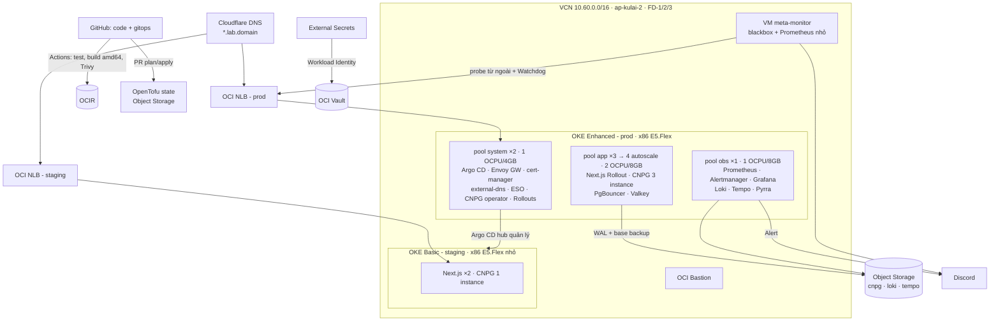

# Đề xuất lab 10 ngày: OKE + IaC/GitOps + Observability/SRE trên OCI

> Người thực hiện: 1 người, 4–6 giờ/ngày · Region: **Malaysia West 2 (Kulai) – `ap-kulai-2`**
> Ngân sách: **$360 credit Free Trial, hết hạn sau ~10 ngày** · DNS: Cloudflare
> Lập ngày 2026-09-17. Giá lấy từ OCI public price list (USD) cùng ngày.

## 0. Tóm tắt

Lab Kamatera trước đã tự dựng kubeadm HA (Keepalived, HAProxy, MetalLB, CNPG, monitoring ngoài
cluster). Lab này **không lặp lại phần đó**. Lab này chuyển sang cách team thật vận hành trên cloud:

1. **Toàn bộ hạ tầng OCI bằng code** (OpenTofu/Terraform): `apply` từ số 0 và `destroy` sạch.
2. **Mọi thứ trong cluster qua GitOps** (Argo CD): staging → prod bằng Pull Request, rollback bằng `git revert`.
3. **Vận hành theo SLO**: metrics + logs + traces, burn-rate alert về Discord, load test, canary tự động
   abort, game day có postmortem.

Để lab thực tế hơn, ứng dụng được "scale" theo kịch bản: trung tâm mở thành **chuỗi 5 cơ sở,
~2.000 học sinh, 80 lớp**. **Ngày 1–5 đầu tháng** là cao điểm, phụ huynh mở `/pay` và SePay bắn
webhook dồn dập.

| Hạng mục | Dự kiến |
| --- | --- |
| Chi phí ước tính | **≈ $119** chạy 24/7 từ Day 2, **≈ $149** khi cộng 25% dự phòng |
| Credit còn dư cho stretch | ≈ $210 (credit không dùng sẽ mất, xem §8) |
| Ràng buộc thật sự | **Service limit của Free Trial** (OCPU E5, số OKE cluster, số LB), không phải tiền |
| Deadline cứng | Teardown xong **trước giờ credit hết hạn ít nhất 12 giờ** |

---

## 1. Bối cảnh và ràng buộc

| Ràng buộc | Hệ quả cho thiết kế |
| --- | --- |
| `ap-kulai-2` chỉ có **1 Availability Domain** | HA dựa trên **3 Fault Domain**. Không mô phỏng được sự cố mất AD, cần ghi rõ trong báo cáo. |
| Free Trial hết hạn ~10 ngày | Day 0 phải xem ngày giờ hết hạn chính xác. Tài nguyên trả phí bị thu hồi khi hết trial, nên mọi config, dashboard và báo cáo phải nằm trong Git. |
| Trial có service limit thấp | Day 0 kiểm tra limit OCPU của E5, số OKE cluster, số LB. Nếu thiếu thì dùng phương án B (§9). |
| ingress-nginx đã bị Kubernetes cho **retire** (hết bảo trì từ 03/2026) | Lab cũ dùng ingress-nginx. Lab này chuyển sang **Gateway API + Envoy Gateway**. |
| `src/lib/rate-limit.ts` lưu bucket trong RAM, comment ghi rõ chỉ đủ cho 1 instance | Khi chạy ≥2 replica, limit thực tế nhân theo số pod. Đây là bug thật cần sửa (F3). |
| `NEXT_PUBLIC_APP_URL` là biến `NEXT_PUBLIC_*` | Next.js có thể inline giá trị lúc build, làm hỏng nguyên tắc "build once, deploy many" giữa staging/prod. Day 4 cần kiểm tra và chuyển sang biến runtime nếu cần. |
| Không dùng dữ liệu, secret, SePay thật của production | Webhook chạy bằng **simulator** ký bằng secret lab (F4). |

---

## 2. Kiến trúc mục tiêu



| Lớp | Công cụ | Lý do chọn |
| --- | --- | --- |
| IaC | OpenTofu (hoặc Terraform ≥1.12), provider `oci`, tflint, Trivy config scan | Phổ biến nhất. State lưu ở Object Storage, có locking. |
| Cluster | **OKE Enhanced** cho prod ($0.10/giờ), **OKE Basic** cho staging (control plane miễn phí) | Enhanced cần cho Workload Identity và add-on. Basic + node E5.Flex nhỏ giữ staging rẻ (~$2/ngày), tránh lệ thuộc capacity ARM A1 (hay báo "Out of host capacity" ở region này). |
| Networking | VCN-native pod networking, NSG, NAT/Service Gateway, OCI **NLB** (miễn phí) | Giống cấu hình production trên OCI. NLB giữ được client IP. |
| Ingress/TLS/DNS | Gateway API + Envoy Gateway, cert-manager (Cloudflare DNS-01), external-dns (Cloudflare) | Thay ingress-nginx đã retire. DNS và certificate đều tự động. |
| GitOps | Argo CD (app-of-apps + ApplicationSet), Helm chart ứng dụng, Argo Rollouts | Promote qua PR, sync wave, PreSync hook chạy migration. |
| Secrets | OCI Vault + External Secrets Operator | Trong Git không có secret nào. |
| Database | CloudNativePG 3 instance, rải trên 3 FD, PgBouncer Pooler, Barman Cloud plugin → Object Storage (S3-compat) | PITR và DR drill thật. |
| Observability | kube-prometheus-stack, Loki + Grafana Alloy, Tempo, OpenTelemetry SDK, Pyrra (SLO) | Đủ metrics, logs, traces và SLO. Tái dùng rule/dashboard có sẵn trong `monitoring/`. |
| Test/Chaos | k6-operator, Chaos Mesh, OCI Console/CLI (terminate node) | Load test và game day. |
| FinOps | OCI Budgets (tạo bằng Tofu), cost-tracking tag, Cost Analysis | Tránh để lọt chi phí. |

---

## 3. Chức năng thêm vào ứng dụng (để có gì mà quan sát và scale)

Mỗi mục là 1 PR nhỏ, đi qua pipeline GitOps như một thay đổi thật.

| ID | Chức năng | Làm gì | Phục vụ |
| --- | --- | --- | --- |
| F1 | `/api/metrics` (prom-client) | Histogram HTTP theo route. Counter nghiệp vụ: `qltt_webhook_received_total{result=matched\|unmatched\|duplicate\|invalid}`, `qltt_invoice_paid_total`, `qltt_excel_export_duration_seconds`. Không route `/api/metrics` ra Gateway. | SLO, canary analysis |
| F2 | OpenTelemetry + JSON log | `instrumentation.ts` + `@prisma/instrumentation`. Log JSON có `trace_id`, không log PII (SĐT). | Nhảy từ log sang trace sang query |
| F3 | Rate limit dùng chung trên Valkey | Thay `Map` in-memory trong `src/lib/rate-limit.ts`. Nếu Valkey lỗi thì fail-open có metric. | Sửa bug khi chạy nhiều replica |
| F4 | SePay webhook simulator + seed quy mô lớn | Script sinh 5 cơ sở / 80 lớp / 2.000 HS. Simulator ký payload bằng secret lab, có tỉ lệ memo sai/trùng. | Load test, kiểm tra idempotency |
| F5 | CronJob đối soát tài chính | Chạy `scripts/audit-financial-data.ts` mỗi giờ, đẩy kết quả thành metric. Alert `FinancialAuditMismatch`. | Alert về tính đúng của dữ liệu, không chỉ uptime |
| F6 | Fault flag cho lab | Env `LAB_FAULT_LATENCY_MS`, `LAB_FAULT_ERROR_RATE`, **chỉ bật được trong namespace lab** | Tạo bản release lỗi để canary tự abort |

**SLO đề xuất** (rút từ nghiệp vụ, không phải từ hạ tầng):

| SLI | Mục tiêu (30 ngày) |
| --- | --- |
| `/pay/*` trả về không phải 5xx | 99.5% |
| `/pay/*` p95 latency | < 800 ms |
| Webhook SePay xử lý thành công (2xx, không mất giao dịch) | 99.9% |
| Đối soát F5 không mismatch | 100%, lệch 1 lần là page |
| RPO / RTO database | ≤ 5 phút / ≤ 30 phút |

---

## 4. Cấu trúc repo đề xuất

```text
infra/oci/
  modules/{network,oke,node-pools,storage,iam,vault,budget}/
  envs/lab/{main.tf,backend.tf,variables.tf,lab.tfvars.example}
gitops/
  bootstrap/root-app.yaml            # app-of-apps
  platform/<addon>/                  # Argo CD Application + values
  apps/qltrungtam/chart/             # Helm chart, chuyển từ deploy/k8s-lab/manifests
  envs/{staging,prod}/values.yaml    # image tag chỉ đổi ở đây
tests/load/                          # k6 scenarios, webhook simulator (F4)
docs/labs/oci/                       # capacity report, postmortem, cost report
.github/workflows/{infra.yml,app.yml}
```

---

## 5. Lịch 10 ngày

Mỗi ngày chia **Core** (bắt buộc, ~4 giờ) và **Stretch** (làm nếu còn giờ). Mọi ngày đều có
**DoD** (Definition of Done) đo được.

### Day 0 · tối 17/09 · ~1 giờ · $0

- [ ] **Billing → Subscriptions**: ghi lại *ngày giờ* credit hết hạn. Đây là deadline teardown.
- [ ] **Governance → Limits, Quotas and Usage**: ghi limit của `standard-e5-core-count`, số OKE cluster, NLB, Block Volume.
- [ ] Tạo compartment `qltt-lab`, API signing key cho Tofu, Customer Secret Key (S3-compat).
- [ ] Tạo Budget thủ công (Day 1 chuyển thành code): alert ở mức **$60 / $120 / $180 / $250**.
- [ ] Cloudflare: API token chỉ có quyền `Zone:DNS:Edit` cho 1 zone. Chọn subdomain `lab.<domain>`.
- [ ] Tạo branch `oci-lab`. Tạo sẵn Discord webhook riêng cho lab (không dùng channel production).

### Day 1 · IaC foundation · ~$1

**Core**
- Module `network`: VCN, subnet (Kubernetes API endpoint, worker, pod, LB), IGW/NAT/Service Gateway, NSG.
- Module `storage`: buckets `tfstate`, `cnpg-backup`, `loki`, `tempo`. OCIR repo `qltrungtam`.
- Module `iam` + `vault` + `budget`. Tag mặc định `project=qltt-lab` cho mọi resource.
- Remote state trên Object Storage có locking.
- Workflow `infra.yml`: `fmt`, `validate`, `tflint`, Trivy config, và `plan` comment vào PR.

**DoD**: `tofu destroy && tofu apply` chạy lại từ đầu **< 15 phút**, plan lần 2 trả về "No changes".

**Stretch**: pre-commit hook. OCI Bastion session để vào subnet private.

### Day 2 · OKE clusters · ~$8

**Core**
- Cluster `prod` (Enhanced). Chọn **bản Kubernetes thấp hơn bản mới nhất 1 minor** để Day 8 tập upgrade.
- Node pool có placement trải FD-1/2/3 (sizing đã cắt bớt phần thừa cả CPU lẫn RAM — xem lý do ở §6):
  `system` 2×E5.Flex **1 OCPU/4 GB** (taint), `app` 3×2 OCPU/**8 GB**, `obs` 1×**1 OCPU/8 GB** (taint).
- Cluster `staging` (Basic): 2×E5.Flex 1 OCPU/8 GB, amd64 (bỏ A1 — region `ap-kulai-2` hay báo "Out of host capacity" cho Ampere, không đáng để lab bị chặn tiến độ).
- Add-on Cluster Autoscaler cho pool `app` (min 3, **max 4** — không phải 5, xem lý do quota ở §6).
- API endpoint public nhưng NSG chỉ allowlist IP của bạn (hoặc private + Bastion nếu còn giờ).

**DoD**: `kubectl get nodes -L oci.oraclecloud.com/fault-domain` thấy node trải đủ 3 FD. Xoá 1 node pool rồi apply lại thành công.

**Lưu ý**:
- Với VCN-native, số pod tối đa trên node phụ thuộc số VNIC, và số VNIC tối đa của Flex shape tăng theo OCPU. Pool `app` giữ nguyên 2 OCPU/node để giữ được mức **~31 pod/node** đã biết trước; pool `system`/`obs` giảm xuống 1 OCPU vì số pod chạy trên đó ít (control-plane addon, không phải nơi pack nhiều pod).
- Sau khi node lên, chạy `kubectl describe node <system/obs node>` xem `pods capacity` thực tế — nếu quá thấp so với số addon cần chạy thì tăng lại OCPU của pool đó.

### Day 3 · Bootstrap GitOps + platform · ~$16

**Core**
- Tofu cài **duy nhất Argo CD** (helm_release). Sau đó apply `root-app.yaml`. Từ đây Tofu không đụng vào cluster nữa.
- Argo CD đăng ký cluster `staging` (mô hình hub-spoke).
- Platform app theo sync wave: cert-manager → external-dns → Envoy Gateway (Service annotation NLB) → ESO + OCI Vault (Workload Identity) → CNPG operator → Argo Rollouts.

**DoD**: `https://argocd.lab.<domain>` có cert Let's Encrypt hợp lệ, DNS record do external-dns tự tạo. Xoá tay một Deployment platform, Argo tự heal trong < 3 phút.

### Day 4 · App delivery pipeline · ~$16

**Core**
- Chuyển `deploy/k8s-lab/manifests` thành Helm chart: Rollout, Service, HTTPRoute, PDB, HPA, NetworkPolicy, ExternalSecret.
- CNPG `prod` 3 instance, anti-affinity theo FD, `Pooler` PgBouncer, backup lên Object Storage bằng Barman Cloud plugin, ScheduledBackup hằng ngày.
- Migration chạy bằng Argo CD `PreSync` hook, dùng lại `deploy/k8s-lab/Dockerfile.migrate`.
- `app.yml`: test → build **amd64** → Trivy → push OCIR (tag = git SHA) → bot mở PR sửa `gitops/envs/staging/values.yaml`. (Không cần build arm64 vì cả staging lẫn prod đều chạy E5/x86.)
- Promote lên prod bằng PR copy tag, cần approve.
- Kiểm tra vấn đề `NEXT_PUBLIC_APP_URL` (§1).

**DoD**: merge vào `main` thì staging có bản mới trong **≤ 10 phút**. Promote prod bằng 1 PR. `git revert` thì quay về bản cũ, không cần `kubectl`.

### Day 5 · Thêm chức năng F1, F3, F4, F5 · ~$16

**Core**: F1 metrics, F3 Valkey rate limit (+ unit test cho case nhiều instance), F4 seed + simulator, F5 CronJob đối soát. Tất cả deploy qua pipeline Day 4.

**DoD**: 3 replica dùng chung 1 limit (test gọi login sai N+1 lần xoay vòng giữa các pod vẫn bị chặn). Webhook gửi trùng không tạo 2 transaction.

**Stretch**: F6 fault flags.

### Day 6 · Observability stack · ~$16

**Core**
- kube-prometheus-stack trên pool `obs`: ServiceMonitor app, PodMonitor CNPG, kube-state-metrics.
- Port rule từ `monitoring/prometheus/rules` và `deploy/k8s-lab/monitoring/rules`. Dashboard `sre-overview.json` provision bằng ConfigMap sidecar.
- Loki (backend Object Storage) + Grafana Alloy. Tempo + F2 OpenTelemetry. Cấu hình datasource để nhảy log ↔ trace.
- Alertmanager → Discord lab. **Mọi alert có `runbook_url`** (đóng luôn việc còn mở #1 trong `docs/OPERATIONS.md`).
- VM meta-monitor ngoài cluster (E2.1.Micro Always Free nếu region có): blackbox probe `/api/health` + nhận heartbeat `Watchdog`. Nếu Prometheus trong cluster chết thì vẫn có alert.

**DoD**: bấm link trong alert Discord → dashboard Grafana → exemplar/trace của request chậm → dòng log cùng `trace_id`.

### Day 7 · SLO + load test + capacity · ~$19

**Core**
- Pyrra định nghĩa SLO ở §3, sinh multi-window burn-rate alert.
- Seed F4 quy mô 2.000 HS. k6-operator chạy trên pool `loadgen` tạm (2 node, scale về 0 khi xong) với 3 kịch bản:
  1. **Sáng mùng 1**: 1.500 phụ huynh mở `/pay` trong 30 phút, 800 webhook.
  2. **Spike ×10** trong 5 phút.
  3. **Soak** 2 giờ, kèm admin export Excel song song (ExcelJS tốn CPU).
- HPA app theo CPU, Cluster Autoscaler thêm node, quan sát `max_connections` so với số pod (PgBouncer).

**DoD**: file `docs/labs/oci/capacity-report.md` có RPS tối đa khi vẫn giữ SLO, điểm nghẽn đầu tiên, số pod/node cần, **chi phí ước tính cho mỗi 1.000 học sinh**.

### Day 8 · Progressive delivery + upgrade · ~$19

**Core**
- Argo Rollouts canary 10% → 30% → 100% với `AnalysisTemplate` query Prometheus (error rate, p95).
- Cố tình ship bản bật F6 (latency 1.5s, 5% lỗi) trong lúc k6 chạy nền. Canary phải **tự abort**, error budget tiêu tốn < 2%.
- Upgrade control plane OKE lên minor mới, sau đó cycle node pool (PDB phải giữ được SLO).
- CNPG switchover có kế hoạch.

**DoD**: có timeline trên Grafana (annotation) cho cả 3 sự kiện, không vi phạm SLO.

### Day 9 · Game day + DR · ~$20

Chạy dưới tải k6 nền. Mỗi kịch bản ghi: thời điểm phát hiện, alert nào kêu, thời gian khôi phục, RPO thực tế.

| # | Kịch bản | Kỳ vọng |
| --- | --- | --- |
| G1 | Chaos Mesh kill pod CNPG primary | Failover < 30s, webhook không mất giao dịch |
| G2 | Terminate 1 instance node `app` trên OCI Console | Node pool tự thay node, PDB giữ ≥ 2 pod |
| G3 | Cordon + drain toàn bộ node trong **FD-1** | App và DB vẫn phục vụ từ FD-2/3 |
| G4 | Xoá namespace `qltrungtam` | Argo CD dựng lại, CNPG **restore PITR** từ Object Storage, đo RTO/RPO |
| G5 | Revoke Cloudflare token, hoặc ép cert gần hết hạn | Alert cert-manager/external-dns kêu trước khi user bị ảnh hưởng |
| G6 | Webhook flood + chữ ký sai | Rate limit F3 chặn, metric `invalid` tăng, app không sập |
| G7 | Làm đầy volume Prometheus | Meta-monitor phát hiện, không bị mù hoàn toàn |

**DoD**: bảng RTO/RPO và **2 postmortem** (blameless, có action item) trong `docs/labs/oci/`.

### Day 10 · Rebuild từ số 0 + teardown · ~$8

**Core**
1. Xoá sạch rồi dựng lại toàn bộ bằng 1 chuỗi lệnh: `tofu apply` → root app → Argo sync → restore DB. **Bấm giờ.** Đây là bài kiểm tra cuối cho IaC/GitOps.
2. Export: dashboard JSON, capacity report, postmortem, screenshot, Cost Analysis.
3. Teardown **đúng thứ tự** (xem §7): xoá Service LoadBalancer và PVC trước, rồi `tofu destroy`.
4. Kiểm tra lại trên Console: không còn LB, Block Volume, Boot Volume orphan, không còn instance.

**DoD**: thời gian rebuild được ghi lại. Chi phí phát sinh sau teardown = 0.

---

## 6. Ngân sách

### Chi phí chạy ổn định (prod 24/7)

| Thành phần | Cấu hình | $/giờ |
| --- | --- | ---: |
| OKE Enhanced | 1 cluster | 0.100 |
| Pool `system` | 2 × E5.Flex 1 OCPU / 4 GB | 0.076 |
| Pool `app` | 3 × E5.Flex 2 OCPU / 8 GB (baseline) | 0.228 |
| Pool `obs` | 1 × E5.Flex 1 OCPU / 8 GB | 0.046 |
| Staging | OKE Basic + 2 × E5.Flex 1 OCPU / 8 GB | 0.092 |
| 2 × Network Load Balancer | | 0.000 |
| Meta-monitor | E2.1.Micro Always Free | 0.000 |
| **Tổng (baseline)** | | **0.542 ≈ $13.0/ngày** |
| **Tổng (peak, `app` autoscale ×4)** | | **0.618 ≈ $14.8/ngày** |

Đơn giá tham chiếu: E5 $0.03/OCPU-h + $0.002/GB-h · OKE Enhanced $0.10/cluster-h · Block Volume
$0.0255/GB-tháng + $0.0017/VPU/GB-tháng · Object Storage 10 GB đầu miễn phí · Egress APAC 10 TB/tháng
đầu miễn phí.

**Sizing đã cắt bớt cả CPU lẫn RAM so với bản đầu** — `system` và `obs` chạy control-plane addon (Argo CD,
cert-manager, Prometheus, Loki...), tổng nhu cầu thực tế ở quy mô lab chỉ khoảng 2-4GB/node, nên 16-32GB
là dư thừa; giảm xuống 4-8GB vẫn còn dư buffer. Giữ nguyên **2 OCPU/node cho `app`** vì đó là nơi thật sự
nhận traffic + chạy CNPG, cần cho cả mật độ pod/node (~31 pod, xem Day 2) lẫn CPU lúc load test; RAM của
`app` cũng cắt từ 16GB xuống 8GB vì Next.js + CNPG + PgBouncer + Valkey ở quy mô test (không phải
2.000 học sinh thật cùng lúc) không cần nhiều đến vậy — nếu Day 7 load test thấy pod bị OOM thì tăng lại.
`system`/`obs` giữ 1 OCPU (không phải 2) vì đó là ràng buộc để **không vượt quota 13 OCPU E5**, không
phải do cắt giảm quá tay — nếu nâng lên 2 OCPU cho 2 pool này, baseline đã chạm 14/13 OCPU, tức apply sẽ
fail ngay cả trước khi `app` kịp autoscale.

**Kiểm tra quota OCPU E5 (limit AD hiện có: 13 OCPU)**:

| Kịch bản | `system` | `app` | `obs` | `staging` | Tổng OCPU |
| --- | ---: | ---: | ---: | ---: | ---: |
| Baseline | 2 | 6 | 1 | 2 | **11 / 13** |
| Peak (`app` autoscale ×4) | 2 | 8 | 1 | 2 | **13 / 13** |

Ở mức peak, quota gần như dùng hết — **không còn chỗ cho pool `loadgen` (Day 7) nếu chạy cùng lúc
`app` đang autoscale max**. Cách xử lý: chạy k6 test *trước khi* app đạt max autoscale (theo dõi HPA
qua Grafana), hoặc scale tạm `obs`/`system` xuống 0 replica không cần thiết trong lúc test, hoặc xin
tăng limit E5 nếu Day 0 thấy cần.

### Theo ngày

| Ngày | Nội dung tính tiền | Ước tính |
| --- | --- | ---: |
| 1 | Network, bucket, Vault | $1 |
| 2 | Cluster (prod + staging) chạy ~12 giờ | $6 |
| 3–6 | Chạy 24/7 (baseline) | $52 |
| 7 | + pool loadgen 8 giờ, autoscale +1 node | $15 |
| 8 | + node surge khi upgrade | $15 |
| 9 | + cluster tạm cho restore/DR nếu cần | $16 |
| 10 | Rebuild + teardown | $6 |
| — | Block/boot volume (~500 GB trong 10 ngày) | $8 |
| **Cộng** | | **≈ $119** |
| Dự phòng 25% | | ≈ $149 |

### Stretch dùng phần credit còn dư (~$210)

| Stretch | Chi phí thêm | Giá trị học |
| --- | ---: | --- |
| S1. Tăng pool `app` lên 4 OCPU/32 GB trong Day 7–9 | ~$20 | Ít mất giờ debug OOM/Pending, test tải lớn hơn |
| S2. Blue/green **cluster** upgrade: dựng `prod-v2` song song, Argo CD chuyển workload, Cloudflare đổi DNS | ~$15 | Kỹ năng upgrade ít rủi ro nhất |
| S3. So sánh CNPG với **OCI Database with PostgreSQL** ($0.098/OCPU-h, cộng storage) trong 1–2 ngày | ~$10–25 | Trade-off self-managed vs managed: failover, backup, chi phí |
| S4. Pool `obs` có 2 node, Prometheus HA + Thanos sidecar lên Object Storage | ~$20 | Monitoring không còn single point of failure |

> Credit trial không dùng sẽ mất khi hết hạn. Cứ dùng thoải mái, chỉ cần giữ **guardrail**: Budget alert, tag, kiểm tra Cost Analysis mỗi sáng, và **không upgrade Pay As You Go** trừ khi thật sự cần limit cao hơn. Sau khi upgrade, tài nguyên quên xoá sẽ tính vào thẻ.

---

## 7. Checklist teardown (tránh leak chi phí)

Tài nguyên do **OCI Cloud Controller tạo từ Kubernetes** (LB, Block Volume của PVC) **không nằm trong Tofu state**.
Nếu `tofu destroy` trước, chúng bị bỏ lại hoặc làm destroy fail vì subnet còn đang được dùng.

1. Tắt auto-sync Argo CD (`root-app`).
2. Xoá toàn bộ Gateway (`kubectl delete gateway -A --all`), rồi xoá mọi Service type LoadBalancer còn lại:
   `kubectl get svc -A -o jsonpath='{range .items[?(@.spec.type=="LoadBalancer")]}{.metadata.namespace}{" "}{.metadata.name}{"\n"}{end}'`.
   Làm cho cả 2 cluster, chờ NLB biến mất trên Console.
3. Xoá CNPG cluster và PVC, chờ Block Volume ở trạng thái Terminated.
4. `tofu destroy`.
5. Kiểm tra tay: Compute (Instance, Boot Volume), Block Storage, Networking (LB/NLB, Reserved IP), OCIR, Object Storage.
   Cost Analysis ngày hôm sau phải về ~$0.

---

## 8. Kết quả đầu ra (dùng làm portfolio)

- `infra/oci` dựng toàn bộ hạ tầng từ số 0, có CI plan/lint/scan.
- `gitops/` app-of-apps: platform + app + 2 môi trường, promote bằng PR.
- Ứng dụng có metrics nghiệp vụ, tracing, rate limit phân tán, job đối soát.
- Dashboard SLO, burn-rate alert có runbook, meta-monitoring.
- Capacity report, 2 postmortem, bảng RTO/RPO, thời gian rebuild, cost report.

**Sau khi hết trial**, node E5 của staging sẽ bị tính phí (không có Always Free cho x86), nên cần
`tofu destroy` staging trước khi trial hết hạn nếu không muốn phát sinh chi phí ngoài dự kiến. Nếu muốn
giữ một môi trường GitOps sống miễn phí lâu dài, có thể thử chuyển staging sang Ampere A1 Always Free
(hiện chỉ còn 2 OCPU/12 GB, xem §9) như một bước làm thêm sau khi trial kết thúc — không đưa vào core
lab vì capacity A1 ở `ap-kulai-2` không ổn định.

---

## 9. Rủi ro và phương án B

| Rủi ro | Dấu hiệu | Phương án B |
| --- | --- | --- |
| Limit E5 OCPU của trial < 13 (peak: prod 11 + staging 2) | Node pool báo `LimitExceeded` | Gộp `obs` vào `system` (bớt 1 OCPU). Giảm `app` autoscale max về 3 (không tăng thêm node). Bỏ pool `loadgen`, chạy k6 trên pool `app` lúc thấp tải. Hoặc xin tăng limit (trial thường bị từ chối). |
| Credit hết hạn sớm hơn dự kiến | Day 0 thấy < 10 ngày | Gộp Day 8 vào Day 9. Giữ nguyên Day 10 (rebuild + teardown). |
| Thời gian thực tế không đủ | Trễ > nửa ngày | Bỏ Stretch trước, rồi bỏ G5–G7, rồi bỏ Tempo (giữ metrics + logs). **Không bỏ** Day 4, 6, 7, 10. |
| Chỉ có 1 AD | — | Ghi rõ giới hạn trong báo cáo. Bài DR mất region là bài lý thuyết, dựa trên backup Object Storage. |
| Lộ secret | — | Secret nằm ở OCI Vault. Cloudflare token scope 1 zone. GitHub dùng Environment secret. Không dùng secret production. |

---

## 10. Việc cần bạn xác nhận trước Day 1

1. Ngày giờ hết hạn credit và các limit ở Day 0. Gửi lại để chốt sizing hoặc chuyển sang phương án B.
2. OpenTofu hay Terraform (đề xuất **OpenTofu**, license mở).
3. Repo GitHub public hay private (ảnh hưởng phút Actions miễn phí).
4. Có muốn tách `gitops/` thành repo riêng không (đề xuất **cùng repo** cho gọn trong 10 ngày).
